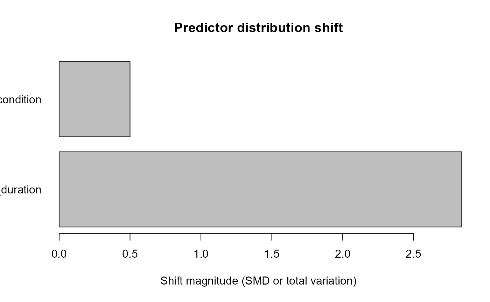

# Dataset Shift and Robustness Auditing

Dataset shift is not one scalar drift score. gp3ml keeps
predictor-distribution shift, missingness shift, prevalence shift,
calibration drift, and performance degradation conceptually separate.

``` r

development <- data.frame(
  fixation_duration = 180 + 1:30,
  condition = rep(c("A", "B"), 15)
)
external <- data.frame(
  fixation_duration = 205 + 1:30,
  condition = rep(c("A", "C"), 15)
)

shift <- audit_gazepoint_dataset_shift(
  development,
  external,
  predictors = c("fixation_duration", "condition")
)

missingness <- audit_gazepoint_missingness_shift(
  development,
  external,
  predictors = c("fixation_duration", "condition")
)

summarize_gazepoint_shift(shift, missingness)
#> $dataset_shift_status
#> [1] "fail"
#> 
#> $dataset_shift_counts
#>   status n_predictors
#> 1   fail            2
#> 
#> $missingness_shift_status
#> [1] "pass"
#> 
#> $missingness_shift_counts
#>   status n_predictors
#> 1   pass            2
#> 
#> attr(,"class")
#> [1] "gp3ml_shift_summary"
plot(shift)
```



Robustness diagnostics should examine dependence on seeds, folds,
features, thresholds, missingness scenarios, and other declared
analytical choices rather than relabelling one successful analysis as
robust.
