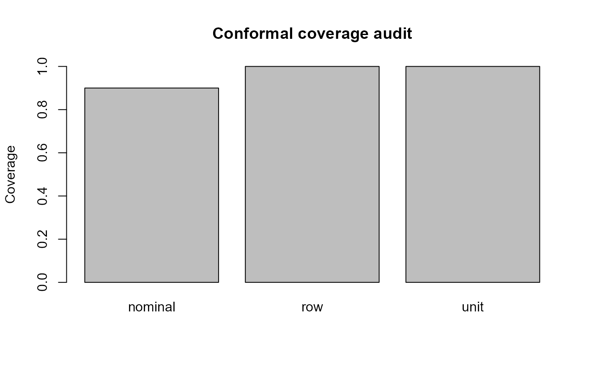

# Target-Aware Conformal Prediction

Performance uncertainty and prediction uncertainty answer different
questions. This workflow calibrates split-conformal prediction to an
explicit unit. Grouped calibration uses the maximum row conformity score
within each supplied unit, which is conservative and records the
calibration semantics.

It does **not** assert distribution-free guarantees under arbitrary
dependence.

``` r

truth <- c(1.0, 1.4, 2.0, 2.5, 3.0, 3.6)
prediction <- c(1.1, 1.3, 2.2, 2.4, 2.9, 3.4)
participant <- c("P1","P1","P2","P2","P3","P3")

fit <- fit_gazepoint_conformal(
  truth = truth,
  prediction = prediction,
  task_type = "regression",
  level = 0.90,
  calibration_unit = "participant",
  unit = participant,
  generalization_target = "new_participants"
)

interval <- predict_gazepoint_interval(fit, prediction)
coverage <- assess_gazepoint_conformal_coverage(
  fit, truth = truth, interval = interval, unit = participant
)

coverage
#> $status
#> [1] "pass"
#> 
#> $nominal_coverage
#> [1] 0.9
#> 
#> $row_coverage
#> [1] 1
#> 
#> $unit_coverage
#> [1] 1
#> 
#> $calibration_unit
#> [1] "participant"
#> 
#> $generalization_target
#> [1] "new_participants"
#> 
#> $by_unit
#>   unit all_rows_covered
#> 1   P1             TRUE
#> 2   P2             TRUE
#> 3   P3             TRUE
#> 
#> $caveat
#> [1] "Coverage claims require exchangeability assumptions appropriate to the declared calibration unit and generalization target."
#> 
#> attr(,"class")
#> [1] "gp3ml_conformal_coverage"
plot(coverage)
```



Do not describe observation-level coverage as new-participant coverage
merely because participant identifiers are present elsewhere in the
study.
