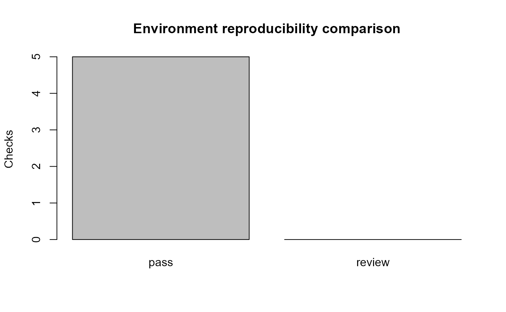

# Portable Models and Research Artifacts

A reproducible model is more than an R object. This layer records the
model, preprocessing, task, feature provenance, decision rule, schema,
environment, and cryptographic file hashes. Optional `bundle` support is
used when available for engines that need custom serialization.

Environment records can be compared before reproducing a result:

``` r

reference <- capture_gazepoint_environment(packages = "gp3ml")
comparison <- compare_gazepoint_environments(reference, reference)
comparison$status
#> [1] "pass"
plot(comparison)
```



A minimal RO-Crate-oriented export can package research files with
SHA-256 hashes. gp3ml deliberately describes this as RO-Crate-oriented
unless an independent conformance validator has also been run.
