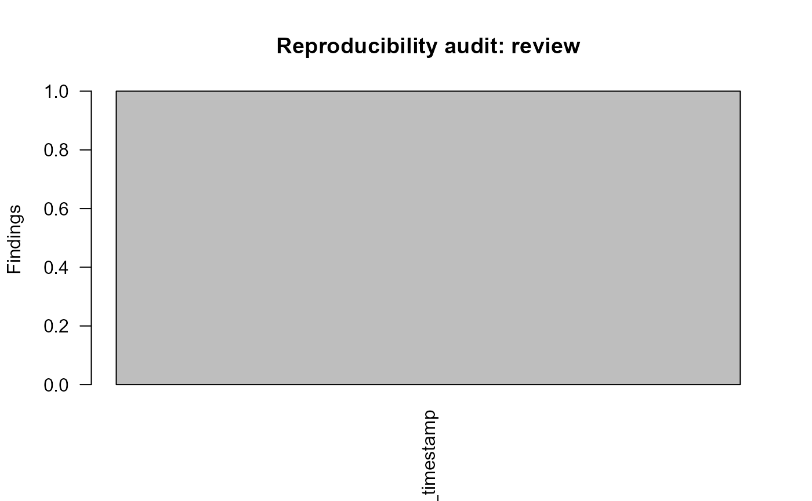

# Reproducibility Hardening

## Deterministic documentation mode

When `gp3ml.reproducible_examples` is `TRUE`, report timestamps and
session details use deterministic documentation placeholders rather than
build-session values. Research use outside documentation retains the
real runtime metadata.

``` r

volatile <- c(
  paste0(
    "Generated",
    ": 2026-07-25 23:26:03 UTC"
  ),
  paste0(
    "<environment: 0x",
    "000001234ABCDEF0>"
  )
)

normalize_gazepoint_artifact_text(volatile)
#> [1] "Generated: <timestamp> UTC" "<environment: <ADDRESS>>"
```

## Audit generated text

``` r

example_file <- tempfile(fileext = ".md")
writeLines(
  paste0(
    "Generated",
    ": 2026-07-25 23:26:03 UTC"
  ),
  example_file
)
audit <- audit_gazepoint_reproducibility(example_file)
audit
#>  gp3ml reproducibility audit: review (1 files, 1 findings)
plot(audit)
```



``` r

unlink(example_file)
```

Before publication, the same audit can be run over generated `docs/`
output to identify runtime-specific paths, addresses, or generated
timestamps.
